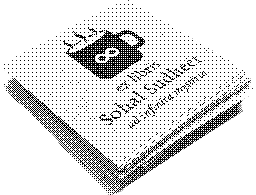

# ex librīs

2023-04-04

During some internet exploration a few days ago, I stumbled upon a [blog post](https://raypatrick.xyz/blog/2023/01/27/my-bookplate/) where the author details making a bookplate for their personal library. Sufficiently intrigued, I began doing a little research on this historic practice, and ended up creating my own.

## What is a bookplate?

A **bookplate** (or *ex librīs*) is a label affixed to the inside of a book, often on the [front endpaper](https://en.wikipedia.org/wiki/Endpaper), indicating the ownership of the book. These get quite creative, with a [wide variety of designs, subject matter, and techniques used](https://rentafont.com.ua/blog/znadibky-Istorychni/exlibrysy-yakova-hnizdovskogo).

The actual medium varies widely as well, with traditional bookplates having their designs [hand engraved into copper](https://en.wikipedia.org/wiki/Burin_(engraving)), being printed onto paper with an [intaglio press](https://en.wikipedia.org/wiki/Intaglio_press), and then glued into a book. 

When looking at modern day bookplates, I saw two main categories. Many bookplates use **self-adhesive paper**, such as ones offered by [commercial sites](https://bookplateink.com/). Others, including the author of the post that initially inspired this, use **stamps**, as besides the initial cost of the stamp, they are exceptionally cheap and easy. However, there is controversy around stamped bookplates as bibliopholes argue that they degrade a book, and decrease it's value rather than increasing it.

## Why bookplates?

An equally interesting topic is the reason for even using bookplates in the first place. Bookplates originally stem from other methods to **indicate ownership** and **dissuade theft** of a book, such as [book rhymes](https://en.wikipedia.org/wiki/Book_rhyme) or [book curses](https://en.wikipedia.org/wiki/Book_curse) printed within a book. They're also **surprisingly old**, with the first "modern bookplate" being from 15th century Germany. Over the following centuries, it became very common for affluent people with personal libraries to have their own bookplates, and have been extremely helpful in [helping modern historians trace the ownership of old books](https://www.atlasobscura.com/articles/mystery-bookplate-collection). 

Around the late 19th to early 20th centuries, bookplates became more common among middle class American households, as they gained wealth and sought to emulate the customs of "old money" families. They also started varying more in design, branching out from the traditional crests and coats of arms to have more unique art (I was particularly struck by [Albert Einstein's](https://content.artofmanliness.com/uploads/2014/04/einstein.jpg)). Unfortunately, bookplates fell in popularity by around the 50s, likely due to cultural changes after World War II and the switch to primarily paperback books.

## Creating my own bookplate

Armed with more knowledge and a newfound appreciation for the *ex librīs*, I decided to create my own. I enjoy customizing the objects I own, and this seemed like a fun way to add a personal touch to my own books. I haven't been a super prolific reader since I was a little kid, so my bookplate is more for my arsenal of journals and notebooks, but I do hope that having a bookplate encourages me to purchase and read more books as I build up a humble personal library. 

### Design

The first portion to tackle was the design. I opted to design mine digitally, as it would give me the most flexibility. I downloaded [Inkscape](https://inkscape.org/), and started messing around with some text to come up with this very minimal design with the [Inter](https://github.com/rsms/inter) typeface:


*Note: The images on this site are [dithered](/meta). The SVGs are located [here](https://github.com/sohalsdr/exlibris)*

This one was pretty easy, and looked pretty clean and modern, but I decided I wanted something with a little more character, so I pulled out my legal pad and sketched up this concept:


After an afternoon learning the basics of Inkscape, I then had this design, featuring the [EB Garamond typeface](http://www.georgduffner.at/ebgaramond/):


The motto, *ad īnfīnīta mystēria*, means "to infinite mysteries" in Latin, and reflects my disposition to always learning more. I then chose the coffee/tea mug as it's simple, and something warm and caffeinated is always a great companion to a good book.

### Medium

With a design in hand, the next decision to make was whether to print the bookplate out or turn it into a stamp. Looking at the prices to get a custom stamp made, I decided that it would be simpler and quicker to simply get some self-adhesive paper and print the bookplate on that.

I found these [letter-sized shipping labels](https://www.walmart.com/ip/Avery-Shipping-Labels-White-8-1-2-x-11-True-Block-Laser-Inkjet-10-Labels-15265/34202344?) for cheap enough at my local Wal-Mart, and they seemed decent enough for the job.

As my design was 2 inches by 2 inches, I determined I'd be able to fit 20 of them on my page, and used the `montage` command that `imagemagick` ships to create a printable page with the bookplate tiled 20 times (I'm sure there was a more elegant way to do this):

```
montage -geometry 1024x1024 -tile 4x5 exlibris.png exlibris.png exlibris.png exlibris.png exlibris.png exlibris.png exlibris.png exlibris.png exlibris.png exlibris.png exlibris.png exlibris.png exlibris.png exlibris.png exlibris.png exlibris.png exlibris.png exlibris.png exlibris.png exlibris.png exlibris_print.pdf
```

I then printed this out, cut them using a paper guillotine (this ended up being way harder than I thought), and had my bookplates!



With bookplates in hand, I promptly went and stuck one in the center of the front inside cover of the journals I'm currently using.


## Conclusion

This was a really fun little delve, and I really liked the end result. If this intrigues you as well, why not make your own? I think seeing someone's bookplate in a book I buy secondhand would give me a little extra appreciation for it and make me cherish it that bit more. Bookplates are very individual, so there's no need to stick with conventions or try to fit any one style. Make one in whichever style and medium makes you happy!

I'll likely stick with this design for a while, but may update it eventually as my own tastes change. It may be fun to be able to look at my books later, and be able to determine when I got them just by the bookplate design.

**To check out the SVG files for the two bookplates I made, check out [the repository](https://github.com/sohalsdr/exlibris).**

## Resources

### History

[Wikipedia](https://en.wikipedia.org/wiki/Ex_Libris_(bookplate))

[Book Riot Article](https://bookriot.com/history-of-bookplates/)

[Atlas Obscura Article](https://www.atlasobscura.com/articles/mystery-bookplate-collection)

### Inspiration

[Original Ray Patrick Article](https://raypatrick.xyz/blog/2023/01/27/my-bookplate/)

[Ukrainian Bookplate Collection](https://rentafont.com.ua/blog/znadibky-Istorychni/exlibrysy-yakova-hnizdovskogo)

[Bookplates of Influential Men](https://www.artofmanliness.com/living/reading/ex-libris-the-bookplates-of-31-famous-men/)

### Other

[Bookplate Ink - Commercial Bookplate Seller](https://bookplateink.com/)

[Printable Shipping Labels](https://www.walmart.com/ip/Avery-Shipping-Labels-White-8-1-2-x-11-True-Block-Laser-Inkjet-10-Labels-15265/34202344?)